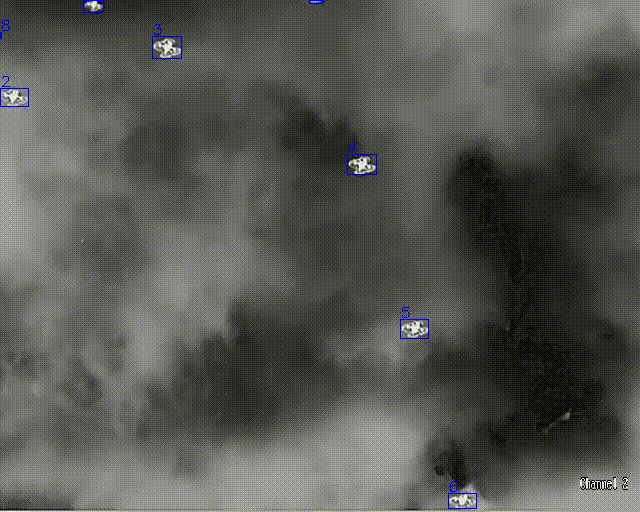
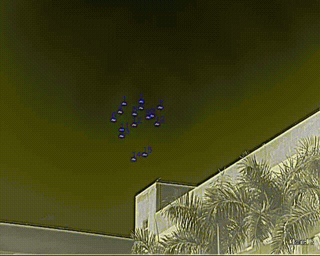
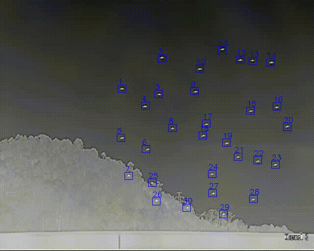
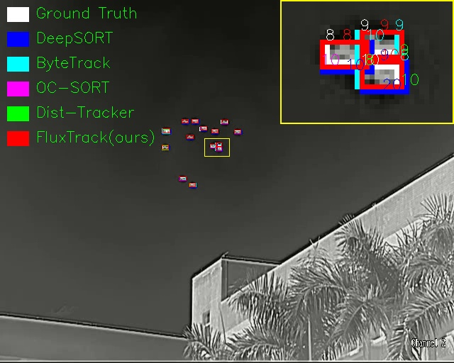
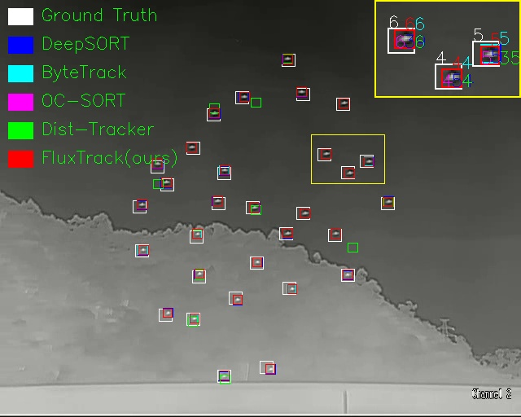

# *<center>Do We Need Kalman Filters? Training-Free Observation-Driven Momentum for Infrared Tiny UAV Multi-Object Tracking</center>*

This repository contains the algorithm done in the
work [Do We Need Kalman Filters? Training-Free Observation-Driven Momentum for Infrared Tiny UAV Multi-Object Tracking](https://github.com/dengfa02/FluxTrack)
by Chuiyi Deng et al. We will make the complete code publicly available after the paper is accepted.

**Update**:TODO
```
@article{FluxTrack,
  author = {Chuiyi Deng, Shuangxin Wang, Zongyu Zuo, Yanyin Guo, Zhuoyi Zhao, Rui Zheng, and Junwei Li},
  title = {Do We Need Kalman Filters? Training-Free Observation-Driven Momentum for Infrared Tiny UAV Multi-Object Tracking},
  journal = {xxx},
  year = {2026},
}
```

## Video Visualization


## ID Results



## Domains

**requirements**: The code should be directly runnable with Python 3.x+ and torch 1.x+. The older versions of Python are no longer supported.

Scipy error may be displayed during runtime, just update it to the latest version (e.g. 1.11.2).

`For other dependencies, please refer to requirements.txt`

**Dataset**: 4th Anti-UAV (CVPR2025) [Download](https://anti-uav.github.io/) 

**Loading**: Since we adopt an open detection scheme, 
you can store the detection results of any detector, 
such as YOLOX or DETR, frame by frame in the form of `frame_id,x1,y1,x2,y2,conf`, 
and then directly apply `FluxTrack` to read them to obtain the tracking results.

## Usage
* Run `Customized_detection.py` to perform Tracking inference.
  ```
  $ cd ./FluxTrack
  $ pip install -r requirements.txt
  $ python Customized_detection.py --cmc-method 'sparseOptFlow' --track_high_thresh 0.5 --match_thresh 0.9
  ```
* Results and Logs will be saved to `./tracker/output/`.

## Acknowledge
*This code is highly borrowed from [BoT-SORT](https://github.com/NirAharon/BOT-SORT). Thanks to Nir Aharon.

*This code is highly borrowed from [ByteTrack](https://github.com/FoundationVision/ByteTrack). Thanks to Yifu Zhang.


